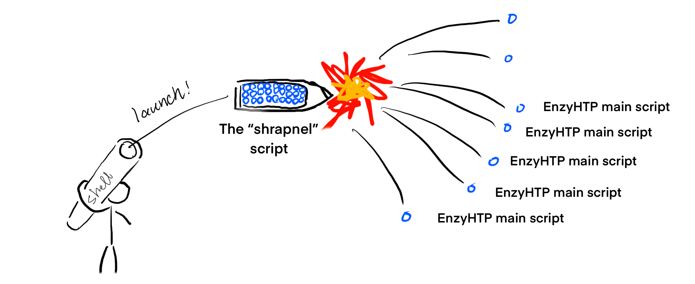

==============================================
 Quick Start: 3. Parallelize the Workflow
==============================================

Overview
===================================

You may notice a problem in the workflow we use in Quick Start 1 -- the mutants in the for loop
are modeled in a serial manner, that is, one mutant can only start after the previous one finishes.
However, 

- those mutants can be modeled in parallel as they are independent in nature. 
- It also allows us to fully utlize available resources to speed up our research.

This tutorial will introduce you the *shrapnel* workflow, which there is a mother script that creates multiple children EnzyHTP working directories
that each contains a main workflow script like the one in quick_start_1. Just like a shrapnel bullet:

.. note::
    | The code below is from ``template/template_shrapnel_main.py``
    | The example working directory of this tutorial is ``template/template_wk_dir_shrapnel/``
    | The current shrapnel script is a temporary solution for parallelizing EnzyHTP workflows. We may release a more
      efficient way of doing this in next EnzyHTP version coming next spring.

Create the template Workflow
===================================

| You need a template for all the children workflows. An example is ``template/template_wk_dir_shrapnel/template_child_main.py``
| In this file, ``XXX`` in line 24 and ``"YYY"`` in line 25 are place holders. The shrapnel script will replace them to actual values corresponding to each children directory.
| This template main script will be distributed to the children directories with the replaced values.

You can modify this example file to create this main script. Reference `Quick start 1 <qkst_general.rst>`_ about this.

Create the submission script
===================================

| You need a submission script to submit the workflow in each children directories.
| An example is ``template/template_wk_dir_shrapnel/template_hpc_submission.sh``.
| This script will be copied to all the children directories and will be used for the submission.

You can modify this example script to create this submission script. Reference `here <qkst_general.rst#running-the-workflow>`_ about this.

Use the *shrapnel* script
===================================

You may comment/uncomment functions in ``main()`` to change its behavior. Here are directions for using each functions.

Generate children workdirs
-----------------------------

Generate children workdirs
-----------------------------

.. panels::

    :column: col-lg-12 col-md-12 col-sm-12 col-xs-12 p-2 text-left

    In ``line 124``, ``main()`` function, the ``generate_sub_wkdirs()`` function generate children working directories
    that each contains a EnzyHTP main script.

    .. code:: python

        num_group = 5 # the number of groups
        child_script="template_child_main.py"
        submission_script="template_hpc_submission.sh"
        data_rel_path="Mutation.dat"

        # == generate sub-directories ==
        with open("mutant_list.pickle", "rb") as f:
            mutants = pickle.load(f)
        generate_sub_wkdirs("KE_07_R7_2_S.pdb",
                            mutants,
                            child_script,
                            submission_script,
                            num_group)

    1. Config the function by setting the variables

        num_group
            | The number of children working directories you want to generate.
            | Each children working directory is a normal EnzyHTP working directory that can be submitted individually.
            | The mutants will be divided into groups based on this number and modeled in each children dir.
            | **Basicly set this value to the number of GPUs you plan to use in total.**
        
        child_script
            The path of the child main script.
            This script will be copied to each children working directories

        submission_script
            same as above but for the submission script

        data_rel_path
            the path of the output data file for each children working directories
        
    2. Set your target mutants

        | In the template, we load a python list of mutants from a pickle file.
        | The list is exactly what is shown in ``template/tool/make_pickle_mutant.py``. The file
        | also shows the way of making it a pickle file. 
        | Directly defining the mutants in the shrapnel_main.py script works as well.

    3. Set your target wild-type

        | Change "KE_07_R7_2_S.pdb" to the path of your wild-type PDB.
        | The requirement is as same as mentioned `here <qkst_general.html#workflow-configurations>`_.

    4. Leave this function as the only uncomment function in ``main()`` and run the script

        This will generate a directory with the name of your wt_pdb and contains all
        the children directories. Click into them to get the idea.

Submit children workdirs
-----------------------------

.. panels::

    :column: col-lg-12 col-md-12 col-sm-12 col-xs-12 p-2 text-left

    In line 124, main() function, the ``submit_jobs()`` function submit the generated children directories.

    .. code:: python

        submit_jobs(range(0,5),
                    sub_script_rel_path=submission_script)

    1. Set the target

        The 1st positional argument of the function allows you to specify the index of the children directories
        you want to submit. (e.g.: range(0,5) gives [0,1,2,3,4] and will submit group_0 to group_4)

    2. Leave this function as the only uncomment function in ``main()`` and run the script

Other functions
-----------------------------

This script also contain other functions that allows you to assign the partitions for part of the children working directories, 
check which groups are completed, and gather the output. But they are rather limited to be only used on ACCRE at Vanderbilt. 
You can look into the function defination and modify accordingly for your own case.
